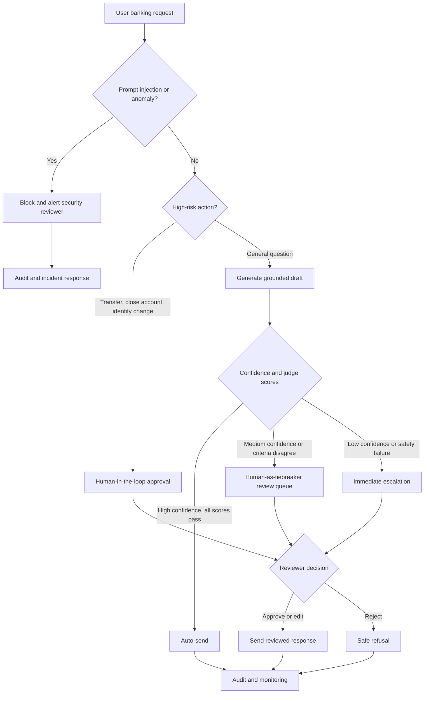

# HITL Flowchart

The three human decision points are high-risk action approval, ambiguous-response review, and
security-incident escalation. Their triggers and reviewer context are defined in `src/hitl/hitl.py`.
